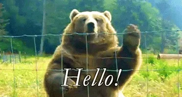

<!-- GIF + Intro -->
<table>
  <tr>
    <td width="500" valign="top" align="center">
      
    </td>
    <td valign="top">
      <h1 style="margin:0">Danyal Malik (Dani-Science) — AI & LLM Specialist</h1>
      

        <strong>LLM & AI Specialist · Machine Learning & Data Science Practitioner · Researcher & Writer</strong> 
        Springer-published researcher · Kaggle competitions expert · Building production-ready ML & LLM solutions.
      

  

  
  
  
  
  
  
  

  </tr>
</table>

---

## Quick Overview
I design and build research-driven AI systems and production ML pipelines.  
My expertise: LLMs, deep learning, computer vision, and applied data science.  
I publish research, compete on Kaggle, and deliver reproducible open-source work.

---

## Core Skills & Tools
**Languages:** Python · R · SQL  
**ML / DL:** Transformers · TensorFlow · PyTorch · Keras · Scikit-learn  
**Data & Viz:** Pandas · NumPy · Plotly · Power BI  
**Deployment & Cloud:** Docker · Streamlit · Gradio · AWS · Azure · TF Serving · FastAPI

---

## Key Projects
- **`llm-finetuning-pipeline`** — Fine-tuning & RAG for domain LLMs.  
- **`production-ml-pipeline`** — Production CI/CD, monitoring, deployment.  
- **`medical-image-segmentation`** — U-Net / EfficientNet pipelines & deploy.  
- **`nlp-text-summarization`** — Transformer-based summarizer + demo.  
- **`kaggle-competition-1`** — Reproducible notebooks, ensemble, writeup.  
- **`document-classifier`** — Streamlit document classifier demo.

---

## Certifications
- TensorFlow Developer Professional  
- IBM Data Science / ML Specialization  
- Deep Learning Specialization (Coursera)

---

## Contact & Collaboration
Open to research collaborations, consulting, and Kaggle mentoring.  

📧 [**Email**](dani.ai.practitioner@gmail.com)  
🔗 [**LinkedIn**](https://www.linkedin.com/in/danyal-ai/)  
📚 [**Google Scholar**](https://scholar.google.co.uk/citations?hl=en&user=ngRPipAAAAAJ)  
🆔 [**ORCID**](https://orcid.org/0009-0003-2897-4157)
